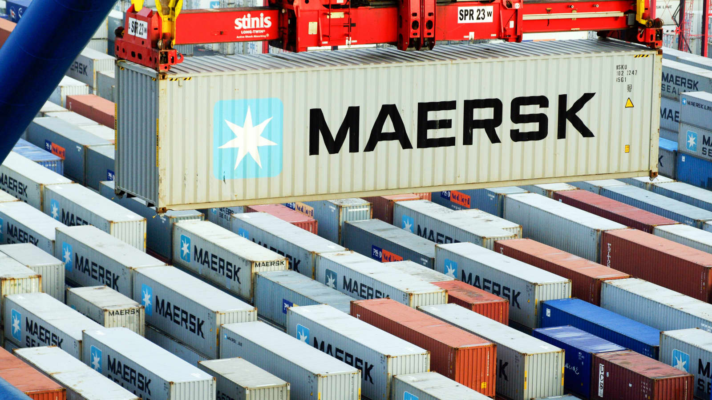

<p align="center">
  <br />
</p>

<br />

<p align="center">
    
    <br />
    Concurrent and Safe file downloader implemented in Golang
</p>

## What is Maersk?

Inspired from [Maersk](https://www.maersk.com/) shipping company, I implemented a file downloader that downloads files
in concurrent. Golang workers allow us to have concurrency when we are downloading a file. Also this can helps us with
error handling and storing the downloaded file parts, so we don't have to download the whole file if an error occurs.

## About Maersk

**Maersk**, is a Danish shipping company, active in ocean and inland freight transportation and associated services, 
such as supply chain management and port operation. 
Maersk was the largest container shipping line and vessel operator in the world from 1996 until 2022.

## How to use?

First install the Golang module in to your project by ```go get github.com/amirhnajafiz/maersk```. If you want to have the stable version of this
library, use ```go get github.com/amirhnajafiz/maersk@latest```.

Now you can create a Maersk **Cargo** with the following options:

```go
import "github.com/amirhnajafiz/maersk"

func main() {
  center := &maersk.Cargo {
    Out: "output.zip",
    URL: "example.com/file.zip",
    Workers: 5,
  }
  
  if err := center.Ship(); err != nil {
    panic(err)
  }
}
```

Parameters of **Cargo** struct are as follows:
 
| Field       | Description                                                     | Value    | Example                         |
| :---------: | --------------------------------------------------------------- | :------: | ------------------------------- |
| Out         | Output file name to store the downloaded information in it      | string   | ```"file.zip"```                |
| URL         | Address of the file that you want to download (http, https url) | string   | ```"example.com/file.tar.gz"``` |
| Workers     | The number of workers to download the file in concurrent        | int      | ```5```                         |
| Chunks      | The max number of chunks to download the file in concurrent     | int      | ```20```                        |
| Timeout     | Timeout for downloading each chunck of file from server         | duration | ```10 * time.Second```          |
| Mode        | Set the error modes of cargo (debug or info or off)             | string   | ```DEBUG, INFO, OFF```          |

You can also use **Order** to make a **Cargo**.

```go
// create shipping order
order := &maersk.ShippingOrder {
  Out: "output.zip",
  URL: "example.com/file.zip",
  Workers: 5,
  Mode: maersk.DEBUG,
  Chunks: 5,
}

// building the cargo
center := maersk.Build(order)
```

For getting the **Cargo** status you can use the ```Reports``` method (returns a **Report** struct).

```go
// calling the reports method
fmt.Println(center.Reports())
```

```go
// Report type
type Report struct {
  Created          time.Time
  NumberOfChunks   int
  DownloadedChunks int
  NumberOfErrors   int
}
```

If you want to stop **Cargo** you can use the ```Cancel``` method.

```go
if err := center.Cancel(); err != nil {
  log.Printf("cargo failed to cancel your order: %v", err)
}
```

## Idea

The idea behind this project is inspired from [Cheikh Seck](https://blog.devgenius.io/concurrent-file-download-with-go-495d7b946492) 
medium story about concurrent file download with Go. Special thanks to **Cheikh** for giving me this idea to build **Maersk**.

## Contribute

Feel free to submit **Issues** about project.
